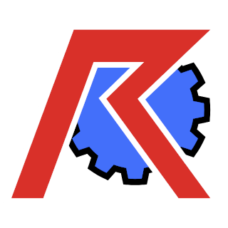

# RevoEngine
RevoEngine is a java-scripting engine which opens up your program and allows users to create their own scripts using "Revo", which is a fancy word for a custom language which is heavily inspired by Java.

The goal of RevoEngine was to allow users to script a game or program and introduce code on-the-fly without having to restart the application and in a sandboxed and safe environment. Furthermore the goal of RevoEngine is that it should work on android, desktop, headless environments and any other platform supporting Java. As such, the usage of reflection should be kept to an absolute minimum.

Another of the must-have goals was for the generated code to be able to extend Java classes. This is made possible by generating all the code required for Revo scripts to attach to Java ahead of time using a custom "RevoGenerator" tool.

## RevoScript Language

The RevoScript language functions very similar to Java, with a few additions and removals here and there. Here are all of the language features:

### Comments

Comments can be placed anywhere within a script and have two variations:
* Single-line comment: `//`
  * This defines the rest of the line as a comment
  * The compiler will ignore the remainder of the line after these two symbols
* Multi-line comment: `/* */` 
  * Using this comment will make the compiler start ignoring code when it encounters the `/*` symbols, and skip over everything until the `*/` symbols are encountered.

### Classes

The class declaration syntax is as follows:
```
MyClassName {
  
  Type1 foo;
  Type2 bar;
  
  new(Type1 constructorParameter) {
    this.foo = constructorParameter;
    methodOne();
  }
  
  void methodOne() {
    print "Accessed methodOne!";
  }
  
  boolean compareFoo(Type1 comparing) {
    return foo == comparing;
  }
}
```
So simply providing the name of the class, followed by a block is enough!

#### Interfaces

A class can be declared as an interface by specifying `interface` before the class name. The class declaration would then look as such: `interface MyInterface {...`

Interfaces cannot introduce new class fields or constructors, they can however introduce new methods to implementing classes.

An interface can be implemented by a class by appending `:` followed by a list of interfaces to append. 
Here is an example: `MyClass : MyInterface, Comparable`

When an interface is implemented, the implementing class must ensure that all methods with undefined bodies are specified!

#### Object inheritance, super classes

Any non-interface class can extend another class by specifying the to-extend class in round brackets after the class name. Here is an example: `MyClass (ArrayList) {...`

This will inherit all fields, methods and interfaces from the superclass!

### Fields

Every Revo class has fields, which carry a value of a specific type.

#### Field declaration

A class field can be simply declared using `Type variable;`
Fields can be initialized during declaration or at a later time using the `=` operator. For example `int foo = 3;`

A field name must be unique for any given class structure. This means that a class `Foo` extending class `Bar` cannot define a field called `myField` if the superclass `Bar` already defines a field with that name.

#### Field calls

A class field can be accessed using the `.` operator. For example: `myObject.foo();`
If a field is declared within a method carrying the same name as a class field, it can be accessed using the `this` operator. Here is an example:
```
MyObject {
  int field = 0;
  
  void myMethod(){
    int field = 3;
    print(field);
    field = this.field;
    print(field);
  }
}
```
In this example, the first print will output the number 3, whereas the next print will output 0!

#### Arrays

Arrays are a fixed-size collection of values which can be accessed using an index. An array can be defined by appending [] after defining the class type. For example: `int[] numbers;`
Arrays have a set size and cannot be shrunk or grown mid-runtime. To access an array's element, simply call the array name, followed by an index surrounded by `[]` brackets (f.e.: `myArray[0]`, `myArray[i]` or `myArray[getIndex()`).
When declaring an array, it can be initialized in three possible ways:
* Sized initialization:
  * Example: `int[] myArray = new int[4]`
  * This will create a new empty array with the specified size.
  * The values inside the array will either have the default primitive value, or null
* Declaring initialization: 
  * This type of declaration predefines all the values inside the arrays, simultaneously with its size
  * This can have two possible syntaxes:
    * When defining a field: `int[] myField = {0, 1, 2, 3};`
    * When calling a method `myArrayMethod(new int[] {0, 1, 2, 3});`
  * The latter syntax for array initalization can also be used for field declarations, however the former cannot be using when calling methods, as methods with the same names might require different types of arrays.

### Methods

Methods are a way of calling a set of instructions with specific parameters which are passed into the class

#### Method Declaration

Method bodies can either have a defined body of instuctions:
```
void printNumber(int number) {
    print "My number is: " + number;
}
```
Or have an undefined body and simply end with a semicolon:
```
boolean shouldPrint(int number);
```

When a method body is not specified, it simply returns the default return value of a primitive, or null and does not execute anything.

#### Overriding methods

When a method matches the signature of a method defined in one of the superclasses or implementing interfaces, the `override` keyword should be attached to the method in order to signify that this method was defined already. While not doing this will result in only a warning instead of an error, it is vital as the syntax of a script can become much clearer due to it.
As an example, let's think of the interface `Foo` which defines the method `void myMethod(int test)`. If we have a class `Bar` implementing `Foo` we must override the method using the following syntax:
```
override void myMethod(int test){
  print "Test was executed: " + test;
}
```

### Object Casting

Revo was designed with simplicity in mind. As such, you do not need to cast from the Object class into any other class. However, casting a class to an inheriting class is otherwise still required. Here are some examples of where casts are needed and where not:
```
Object test = "A String-type value!";
String testString = test; // No cast needed! We are casting from Object to String
Foo foo = new Bar(); // Foo is an interface implemented by Bar
Bar bar = (Bar) foo; // We need a cast here, in order to prevent coding mishaps
```

### Operator Declaration

TODO 

### Lambdas

TODO 

### Loops
 
TODO 

#### Do / While
 
TODO 

#### While

TODO 

#### For

A for loop consists of three parameters separated by semi-colons (variable initializers, condition and statement) followed by a block body or a statement.
Here is a typical example of a for loop which iterates through an array and prints out each value inside: `for(int i = 0; i < myArray.length; i++)print(myArray[i]);`
This loop is executed as follows:
1. The first parameter defines a variable `i` and assigns it the value 0 (`int i=0;`). 
2. The condition is checked whether the iteration should start (`i < myArray.length;`). 
3. The statement after the for loop is executed (`print myArray[i];`).
4. After the statement is completed, the third parameter (`i++`) is executed. 
5. Then, if the condition is still met (`i < myArray.length`) we go back to step 3!

#### Enhanced For loop

#### Continue / Break

### Exception throwing catching

During program execution, certain exceptions might be thrown 
Exception can be caught by using a try/catch block. This executes the code inside the block and if an Exception is thrown which is specified inside the 

### Class "attaching"

Certain classes can be "attached" onto a program. What this means can vary depending on the program or game using RevoScript.

An example in EndCycle VS would be to attach a new attack pattern class to the list of available attack patterns. This can be done by adding the prefix `attach` before the class declaration as follows: `attach NewAttack (Attack) {...`

#### Attach block

After a class is attached and the program has loaded all the requirements for it, the class' `attached{...}` block is executed. This is an optional block which attaching classes can define **an the very top** in order to load specific features after initialization is completed. An example would be to load a player's inventory only after the item definitions were loaded. Here is an example:
```
attach MyListener : GameEventListener {

  attached {
    inventory = GameData.load("inventory.json");
  }
  
  CustomInventory inventory;
  
  new() {
  }
}
```
In here, the Listener object is created first and attached to the program. Then, after all of the item definitions are finished loading the attached block is called.

### Debugging

When debugging a script, two language features can be employed: `print` and `debug;`.
* The `print` function is a language-level method which takes a string or object and prints it out to the console log of the application.
  * This can be used to debug and track specific object values as they change
  * Example: `print this.counter;` would print the value of a field called counter within the current class
* `debug;` stops the execution of the script and displays information about the current local variables, the current calling stack as well as the values present inside the current class.  


### List of unsupported features compared to Java

While Revo is very similar to Java, some elements which are a core part of Java are not present in the language. Here are some major elements which Revo does not support in order to enforce scripting simplicity:
* Switch statements
* Visibility modifiers (`public`, `protected`, `private`)
* Synchronized and volatile modifiers
* Annotations
* Generics
* Anonymous classes
